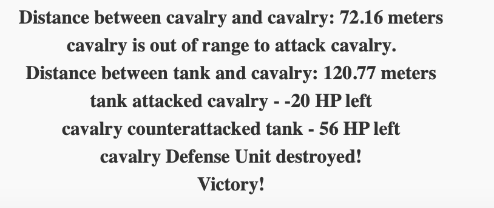

## Design of the Geo-Game 

---
### Read me first :)
**Actually, I had already designed the geogame part in my head before I designed it here, and I had already written more than half of it before the first commit. The purpose of doing this here was to test how much I could actually translate what I thought into code, because my experience in scripting in JS was not as advanced as in python. Since I was able to achieve most of what I wanted, you can see the design below. If I didn't succeed you would probably see an easier puzzle game, but I guess we'll never learn :D**

### Requirements and Layout

#### Game Objective
The game is a geo-based strategy game where players purchase and mobilize units on a map, move them for a cost and that means energy in the game, to achieve a high score by strategically defeating defense units positioned on the map. 

---

#### Layout Components

| **Component**       | **Description**                                                                                                                                   |
|---------------------|---------------------------------------------------------------------------------------------------------------------------------------------------|
| **Map Section**     | Central area where both player units and defense units are positioned on a geographic map. Players interact here to set routes and mobilize units. |
| **Control Panel**   | A side panel with several controls:                                                                                                               |
|                     | - **Purchase Units**: Options to buy infantry, cavalry, tanks, and airplanes using GIS Coins.(1000 GIS Coin)                                      |
|                     | - **Set Routes**: Allows players to plan movement routes for selected units.                                                                      |
|                     | - **Mobilize Units**: Deploys units along defined routes.                                                                                         |
|                     | - **Start Battle**: Begins combat between player and defense units.                                                                               |
|                     | - **GIS Coin Display**: Displays the player’s remaining GIS Coin balance.                                                                         |
| **Battle Status and Log** | Shows current battle information, including:                                                                                                      |
|                     | - **Round Number**: Tracks the ongoing round of battle.                                                                                           |
|                     | - **Actions and Events**: Displays events such as attacks and health changes.                                                                     |
|                     | - **Unit Status Updates**: Keeps players informed on the health and condition of each unit during the battle.                                     |

---

#### Frontend Requirements

| **Requirement**            | **Details**                                                                                                                                               |
|----------------------------|-----------------------------------------------------------------------------------------------------------------------------------------------------------|
| **Interactive Map**        | Built with **Leaflet** for real-time interaction, allowing players to set routes, view unit positions, and track movements.                               |
| **Unit Purchase and Deployment** | Players can buy different types of units (infantry, cavalry, tanks, airplanes) with unique characteristics. Units are deployed on the map with type icons. |
| **Battle Mechanics**       | Manages combat between player and defense units based on position, range, and unit stats. Logs actions like attacks and updates unit health status.      |

---

### JavaScript Libraries

| **Library**                    | **Purpose**                                                                                                                |
|--------------------------------|----------------------------------------------------------------------------------------------------------------------------|
| **Leaflet**                    | Renders the interactive map, displaying player and defense units on a geographic base.                                     |
| **Leaflet Routing Machine**    | Enables path planning for units (infantry, cavalry) that follow map routes.                                                |
| **OpenStreetMap Tiles**        | Provides the map background, displaying geographic details for orientation within the game.                                |

---

### Icon and Unit Representations

| **Unit Type**   | **Icon**                                                                |
|-----------------|-------------------------------------------------------------------------|
| **Infantry**    |                |
| **Cavalry**     |                |
| **Tank**        |                       |
| **Fighter Jet** |         |
| **Cannonball**  |           |
| **Machine Gun** |         |

### Demo Images In Real Game

- **Gameplay Demo Image 1**: _Look for the opening page, there are not much css for looking because the JS part is really hard to handle first goal is make it right._

  

- **Gameplay Demo Image 2**: _Purchase units and set the route._
  
  

- **Gameplay Demo Image 3**: _Units move along the route that cost energy._
  
  

- **Gameplay Demo Image 4**: _Preparing for engagement._
  
  

- **Gameplay Demo Image 5**: _Battle log._
  
  

- **Gameplay Demo Image 6**: _Not an attack animation just range's if there are red lines that means the range of unit not enough, if it's green the line moves every round for user can see who's he/she attack at the moment._
  
  

